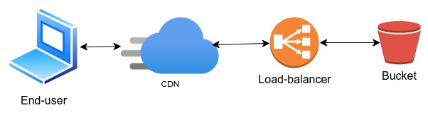

# GCP Terraform Setup for CDN, Load Balancer, Storage, and DNS



## Overview

This repository provides Terraform configuration to set up the following GCP services:

- **Google Cloud Storage**: A private bucket to store your content.
- **Google Cloud CDN**: To cache your content globally for faster delivery.
- **Google Cloud Load Balancer**: To expose the content via a custom domain.
- **Google Cloud DNS**: To manage the DNS for the custom domain.
- **IAM roles and permissions**: To ensure proper access control to the content.

## Prerequisites

Before running the Terraform scripts, ensure you have the following installed:

- [Terraform](https://www.terraform.io/downloads.html)
- [Google Cloud SDK (gcloud)](https://cloud.google.com/sdk/docs/install)

## Authentication

To authenticate Terraform with GCP, follow these steps:

1. Log in to your Google Cloud account:

    ```bash
    gcloud auth login
    ```

2. Set your default project (replace PROJECT_ID with your GCP project ID):

    ```bash
    gcloud config set project PROJECT_ID
    ```

3. Initialize application default credentials (this allows Terraform to interact with your GCP resources):

    ```bash
    gcloud auth application-default login
    ```

## Running the Terraform Code

1. **Clone the Repository**:

    ```bash
    git clone https://github.com/ruslan-k/cloud-storage-hosting.git
    cd cloud-storage-hosting
    ```

2. **Create terraform.tfvars file**: create variable file in terraform/ folder, specify project_id, region and domain_name like in this example:

    ```bash
    project_id  = "my-project-12345"
    region      = "us-west1"
    domain_name = "mydomain12345.com."
    ```

3. **Initialize Terraform**:

    ```bash
    cd terraform
    terraform init
    ```

4. **Apply Configuration**:

    ```bash
    terraform apply
    ```

Confirm the changes and wait for Terraform to provision the resources.

## Opening the CDN Link with Custom Domain (without registering a domain)

To access the content via your custom domain name locally, you will need to map the load balancer's IP address to the domain name in your /etc/hosts file.

1. Get the IP address of the Load Balancer after the Terraform script finishes running. You can find it by running:

    ```bash
    terraform output
    ```

2. Open the /etc/hosts file with a text editor:

    ```bash
    sudo vi /etc/hosts
    ````

3. Add the following entry to map your domain name to the load balancer IP (replace <LB_IP> with the **lb_ip** value from terraform output):

    ```bash
    <LB_IP> mydomain12345.com
    ```

4. Save the file and exit the editor.

Now you should be able to access the content via your custom domain name in your browser.

## Cleanup

To remove all the resources created by Terraform, run:

```bash
terraform destroy
```
